## 🌟 E2B 简介

**E2B（Environment to Build）** 是一个开源的云端沙箱代码执行引擎，专为 LLM 智能体、AI 编程助手、自动化测试等场景设计。它通过轻量级容器技术为每个请求提供完全隔离的执行环境，让 AI 模型可以安全地运行任意代码，而不会对宿主系统造成任何影响。

### 核心特性

- **🔒 安全隔离**：每个沙箱运行在独立的容器环境中，完全隔离于宿主机和其他沙箱
- **⚡ 快速启动**：沙箱实例秒级创建，支持暂停（Pause）与恢复（Resume），状态持久化
- **🐍 多语言支持**：内置 Python、Node.js 等运行时，支持通过自定义 Dockerfile 扩展任意环境
- **📦 模板系统**：支持将自定义环境打包为可复用的沙箱模板，一次构建、多次使用
- **🔌 多端接入**：提供 Python SDK、TypeScript SDK 以及 CLI 工具，灵活集成到各类工作流
- **☁️ 阿里云原生**：基于阿里云 ECS 裸金属实例、RDS PostgreSQL、Redis 构建，稳定可靠

### 整体架构
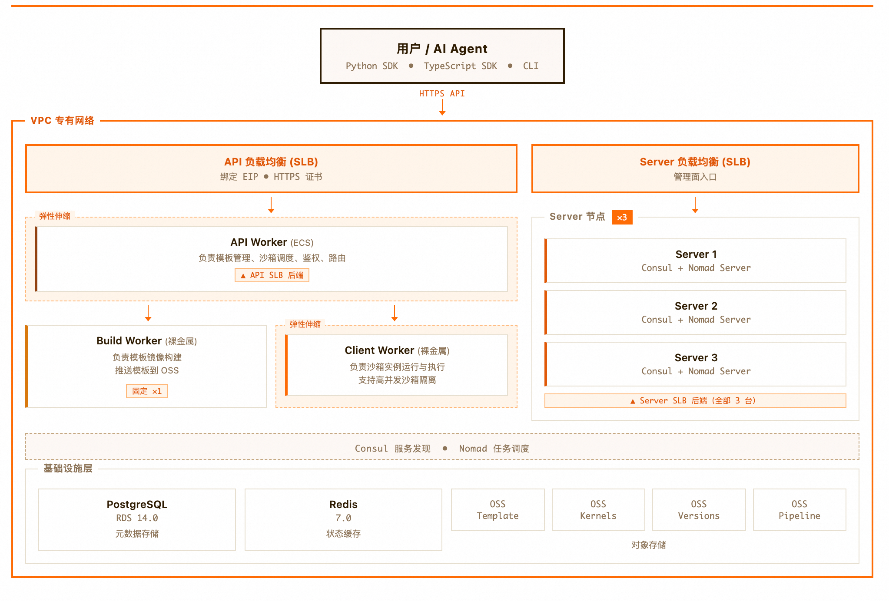

---

## 🚀 部署流程

### 前置条件

> ⚠️ 已开通阿里云账号，并具备 ECS、RDS、Redis、VPC 等资源的创建权限

### 1. 一键创建实例

访问 [计算巢 E2B 社区版部署页](https://computenest.console.aliyun.com/service/instance/create/cn-hangzhou?type=user&ServiceId=service-318e76fe0ae7464f8d5c)，模板选择集群版，按页面提示填写基础参数。
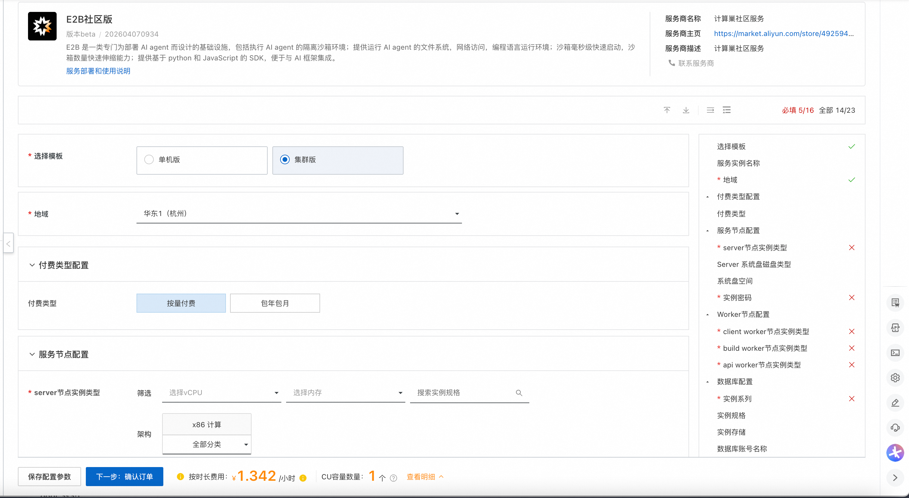

### 2. 确认资源配置

系统将自动生成**费用预估明细**。确认配置无误后，点击 **下一步：确认订单**，核对信息后点击 **立即创建**。

> ⚠️ **注意**：E2B 需要使用域名进行访问。您可以选择以下两种方式：
>
> - **公网域名**：购买公网域名并为其购买或生成自签名 TLS 证书，支持公网访问
> - **自定义域名**：自定义一个域名并生成自定义的 TLS 证书，**此方式无法通过公网访问E2B集群，仅可在 VPC 内部调试调用**。因此我们预置的部分验证python脚本，如Desktop 沙箱部分无法体验。

> - **生成TLS 证书**：生成方式可参考 [生成自签名证书](https://github.com/aliyun-computenest/quickstart-Sandbox-Manager-E2B/blob/main/docs/index.md)

> 🕐 部署过程约需 10～20 分钟，请耐心等待。
### 3. 获取访问地址

部署完成后，在计算巢控制台的实例详情页查看各种配置内容，其中比较重要的是：
- **E2B API URL**
- **E2B API KEY**

这两个内容需要配置到您的环境变量中，以通过SDK访问E2B集群。
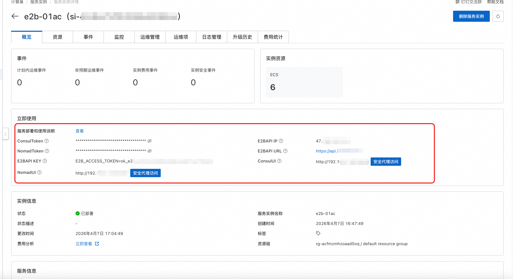

### 4. 初始化基础沙箱模板

首次部署完成后，需要登录到 build 节点（如下图所示），执行以下命令构建基础沙箱模板：

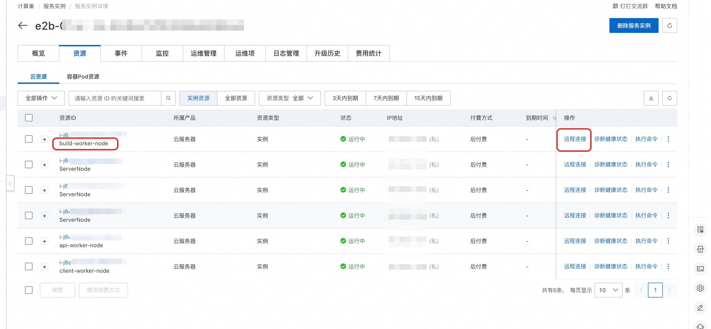


```bash
sudo su
cd /root/script
sh create_template.sh
```

这个脚本默认会构建**代码执行沙箱**模板，基于 `code-interpreter` 镜像，内置 Python 运行时，适合大多数 AI Agent 代码执行场景。

根据你的业务需求，也可以选择其他类型的模板：

```bash
# sh /root/script/create_template.sh --type desktop
# sh /root/script/create_template.sh --type browser-use

# 自定义镜像沙箱（基于你自己的 Dockerfile 构建）
sh /root/script/create_template.sh --docker-file /path/to/your/Dockerfile
```

构建完成后，验证模板是否就绪：

```shell
e2b template list
```

---

## 📖 使用流程

### 🐍 通过 Python SDK 使用

#### 快速开始
> ⚠️ **注意**：使用前，您需要配置好环境变量：
> - E2B_ACCESS_TOKEN，E2B实例部署完成后可以在计算巢控制台的实例详情页查看
> - E2B_API_KEY，E2B实例部署完成后可以在计算巢控制台的实例详情页查看
> - E2B_DOMAIN，E2B 域名，您购买的公网域名or自定义域名

以下示例演示了沙箱的完整生命周期：创建 → 执行命令 → 暂停 → 恢复。

```python
from e2b import Sandbox
import time

def main():
   # 1. 创建沙箱——从模板快照恢复，秒级完成
   # template_id 为模板 ID
   # timeout 为沙箱最大存活时间（秒），超时后自动销毁
   # 步骤1: 创建 sandbox
   print("\n[步骤1] 创建 sandbox...")
   start_time = time.monotonic()
   sandbox = Sandbox.create('dgllk1gmhsbar3l6d08l', timeout=1800)
   input("按回车键继续..." + sandbox.envd_api_url)

   time.sleep(5)
   print(f"创建 sandbox 耗时: {time.monotonic() - start_time:.2f} 秒")
   print(f"Sandbox ID: {sandbox.sandbox_id}")
   print(f"envd host: {sandbox.get_host(49983)}")
   result = sandbox.commands.run('echo "Hello from E2B Sandbox!"')
   print(result.stdout)

   # 步骤2: 暂停 sandbox
   print("\n[步骤2] 执行 sandbox beta_pause...")
   start_time = time.monotonic()
   pause_success = sandbox.beta_pause()
   print(f"pause 耗时: {time.monotonic() - start_time:.2f} 秒")
   print(f"pause success: {pause_success}")

   print("等待 60 秒让 sandbox 完全暂停...")
   time.sleep(60)

   # 步骤3: resume 并验证文件持久化
   print("\n[步骤3] 重新连接 sandbox（resume）...")
   start_time = time.monotonic()
   same_sandbox = sandbox.connect(timeout=180)
   print(f"connect 耗时: {time.monotonic() - start_time:.2f} 秒")
   print(f"重新连接成功，Sandbox ID: {same_sandbox.sandbox_id}")


   print("\n所有步骤执行完毕!")

if __name__ == "__main__":
   main()
```

#### 常用 API 说明

| 方法 | 说明                  |
|------|---------------------|
| `Sandbox.create(template_id, timeout)` | 创建新沙箱，`timeout` 单位为秒 |
| `sandbox.commands.run(cmd)` | 在沙箱中同步执行 Shell 命令   |
| `sandbox.get_host(port)` | 获取沙箱内指定端口的外部访问地址    |
| `sandbox.beta_pause()` | 暂停沙箱，状态持久化到oos      |
| `sandbox.connect(timeout)` | 恢复已暂停的沙箱            |
| `sandbox.kill()` | 销毁沙箱，释放资源           |

---

### 🖥️ 通过 E2B CLI 使用

#### 模板管理

**查看现有模板列表：**

```shell
e2b template list
```

**使用默认镜像创建模板（基于 `e2bdev/code-interpreter`）：**

```shell
sh /root/script/create_template.sh
```

**使用自定义 Dockerfile 创建模板：**

```shell
sh /root/script/create_template.sh --docker-file ./path/to/your/Dockerfile
```

**删除模板：**

```shell
e2b template delete <template-id>
```

#### 沙箱管理

**查看运行中的沙箱：**

```shell
e2b sandbox list
```

**连接到指定沙箱（交互式终端）：**

```shell
e2b sandbox connect <sandbox-id>
```

**终止沙箱：**

```shell
e2b sandbox kill <sandbox-id>
```

---

## ⚖️ 扩缩容配置

E2B 集群版基于阿里云**弹性伸缩（ESS）**实现 API Worker 和 Client Worker 节点的动态扩缩容，以应对不同的负载需求。

### 手动扩缩容

部署完成后，系统已预置以下四条弹性伸缩规则，可在阿里云 ESS 控制台手动执行：

| 规则名称 | 作用 | 调整数量 |
|---------|------|---------|
| `api-scaling-out` | API Worker 扩容 | +1 |
| `api-scaling-in` | API Worker 缩容 | -1 |
| `client-scaling-out` | Client Worker 扩容 | +1 |
| `client-scaling-in` | Client Worker 缩容 | -1 |

**操作步骤：**

1. 进入阿里云计算巢实例详情页，点击资源tab页，筛选弹性伸缩:伸缩组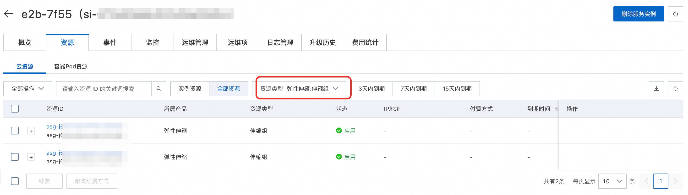
2. 找到对应的伸缩组（`client` 或 `api`）
3. 进入 **伸缩规则** 页面，选择对应规则点击 **执行**

### 注意事项

> ⚠️ **缩容注意**：Client Worker 节点缩容时会触发生命周期钩子，系统会等待节点上的沙箱任务完成后再销毁实例（最长等待 **60 分钟**），请勿强制终止，避免沙箱数据丢失。

> ⚠️ **裸金属限制**：Client Worker 必须使用裸金属实例（`ecs.ebmg6` / `ecs.ebmc6` 系列），扩容时请确保所选可用区有足够的裸金属资源配额。

## 📊 可观测性配置（可选）

E2B 集群版基于阿里云 **Prometheus**、**Grafana** 实现可观测性：按下列步骤集成 Prometheus 与 Loki 后，可在 Grafana 中统一查询 Metrics 与 Logs 并完成可视化。

**操作步骤：**

1. 登录 [阿里云可观测可视化 Grafana 控制台](https://armsnext.console.aliyun.com/grafana#/workspace)。

2. 创建可观测可视化Grafana版：
   - 在左侧导航栏，单击工作区管理。
   - 在工作区列表中，单击创建工作区。
   - 在购买页面，配置地域和集群部署地域一致，版本选择专家版或者高级版，Grafana版本号选择 Grafana 11.4.x，并单击立即购买。

3. 开通私网地址：
   - 在 [阿里云可观测可视化 Grafana 控制台](https://armsnext.console.aliyun.com/grafana#/workspace) 工作区列表中，选择创建的工作区。
   - 在基本信息中，点击开通私网地址

   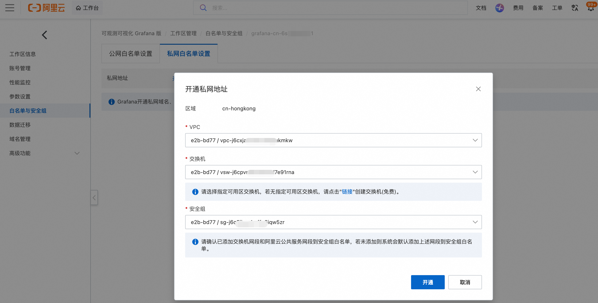

   - 选择集群部署的 VPC、交换机以及安全组，点击开通

4. 集成 Prometheus：
   - 在工作区页面的云服务集成中，选择 Prometheus 监控服务，搜索 prometheus-e2b, 点击集成。

   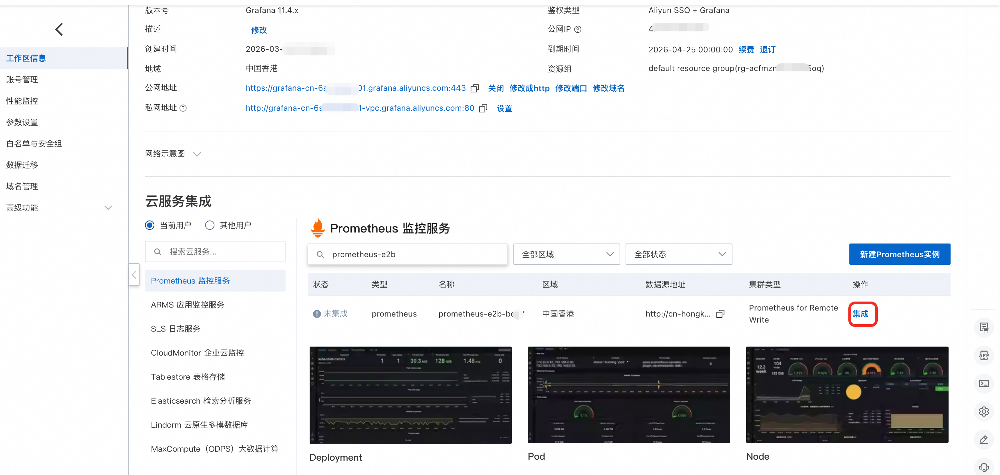

   - 集成数据源，配置ak、sk后，点击确认，请确认配置的 ak 具有 AliyunPrometheusMetricReadAccess 权限。

5. 集成 Loki：
   - 在工作区页面中，点击公网地址，进入 Grafana 公网页面。
   - 在左侧导航栏中，点击添加新连接，选择 Loki。

   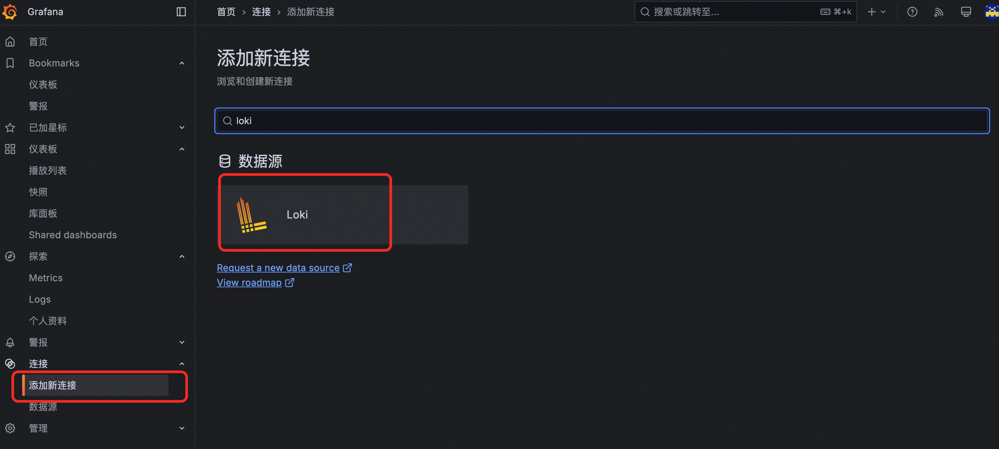

   - 配置 Connection，填写URL格式为：http://{API Worker ECS 的私网 IP}:3100
   
   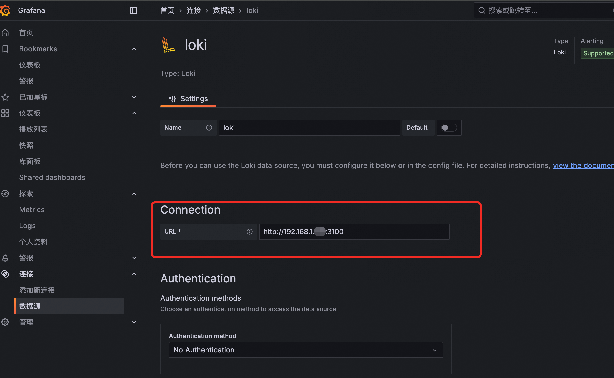   

   - 点击 Save & test 完成配置

6. 集成数据查看：
   - 在 Grafana 公网页面中，点击探索中的 Metrics，选择第 4 步配置的 Prometheus 集成的数据源，即可查看 Metrics 数据。

   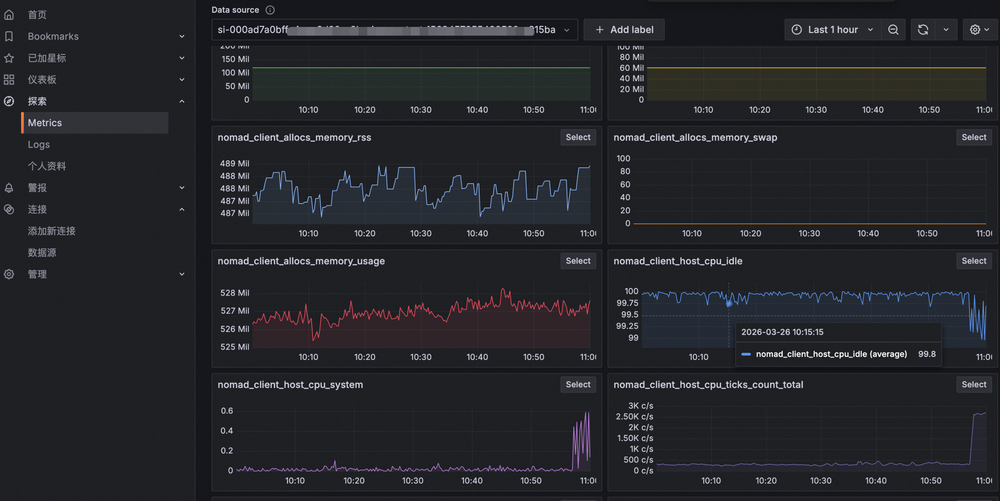

   - 在 Grafana 公网页面中，点击探索中的 Logs，选择第 5 步配置的 Loki 集成的数据源，即可查看 Logs 数据。

   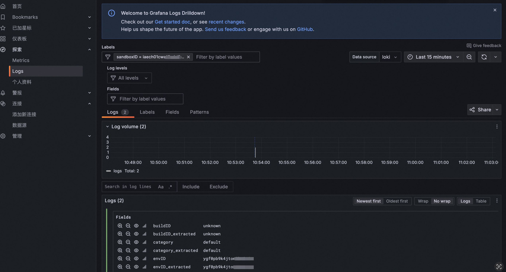
---

## 📚 更多资源

- **官方文档**：[E2B 官方文档](https://e2b.dev/docs)（含完整 API 参考、SDK 文档、智能体集成示例）
- **Python SDK**：[e2b-dev/e2b-code-interpreter](https://github.com/e2b-dev/e2b-code-interpreter)
- **CLI 工具**：[@e2b/cli on npm](https://www.npmjs.com/package/@e2b/cli)
