## 🌟 E2B 简介

**E2B（Environment to Build）** 是一个开源的云端沙箱代码执行引擎，专为 LLM 智能体、AI 编程助手、自动化测试等场景设计。它通过轻量级容器技术为每个请求提供完全隔离的执行环境，让 AI 模型可以安全地运行任意代码，而不会对宿主系统造成任何影响。

### 核心特性

- **🔒 安全隔离**：每个沙箱运行在独立的容器环境中，完全隔离于宿主机和其他沙箱
- **⚡ 快速启动**：沙箱实例秒级创建，支持暂停（Pause）与恢复（Resume），状态持久化
- **🐍 多语言支持**：内置 Python、Node.js 等运行时，支持通过自定义 Dockerfile 扩展任意环境
- **📦 模板系统**：支持将自定义环境打包为可复用的沙箱模板，一次构建、多次使用
- **🔌 多端接入**：提供 Python SDK、TypeScript SDK 以及 CLI 工具，灵活集成到各类工作流
- **☁️ 阿里云原生**：基于阿里云 ECS 裸金属实例、RDS PostgreSQL、Redis 构建，稳定可靠

### 整体架构
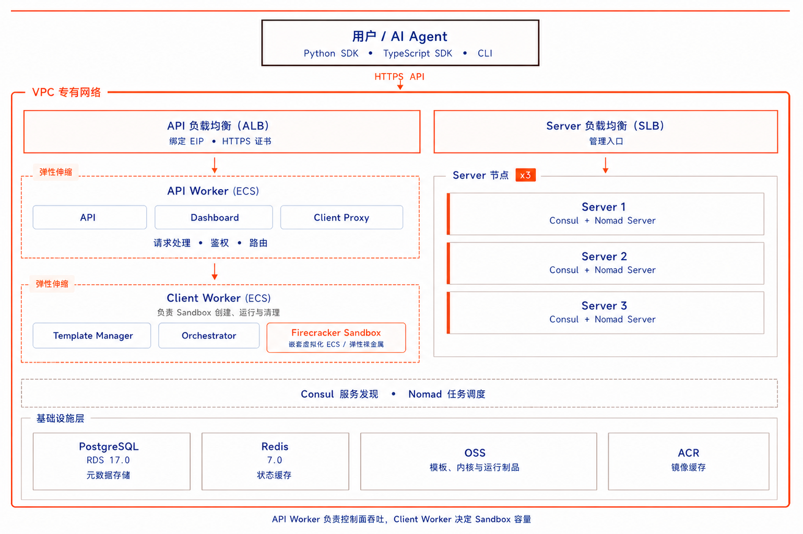

---

## 🚀 部署流程

### 前置条件

> ⚠️ 已开通阿里云账号，并具备 ECS、RDS、Redis、VPC 等资源的创建权限

### 1. 一键创建实例

访问 [计算巢 E2B 社区版部署页](https://computenest.console.aliyun.com/service/instance/create/cn-hangzhou?type=user&ServiceId=service-318e76fe0ae7464f8d5c)，模板选择集群版，按页面提示填写基础参数。
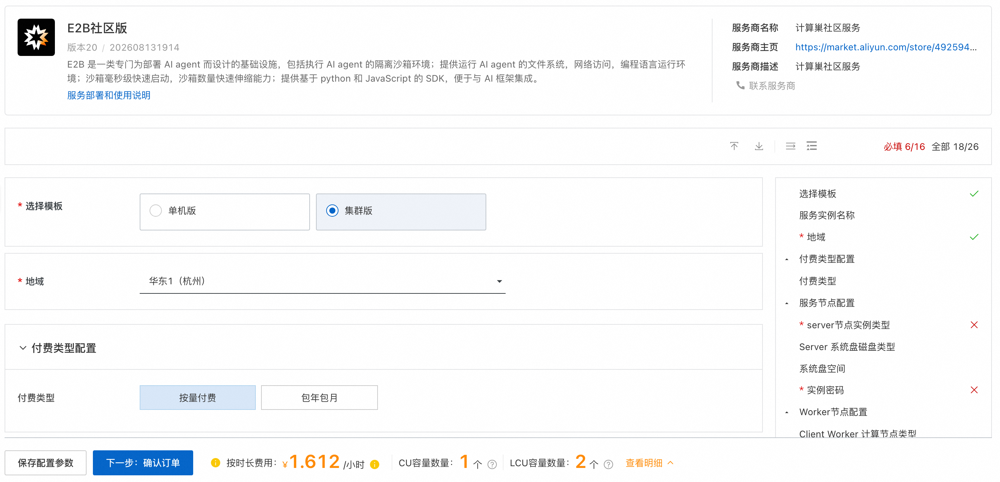

### 2. 确认资源配置

系统将自动生成**费用预估明细**。确认配置无误后，点击 **下一步：确认订单**，核对信息后点击 **立即创建**。

> ⚠️ **注意**：ECS 嵌套虚拟化目前处于邀测阶段，部署前需完成加白，否则可能导致部署失败。详情请参见 [为ECS实例开启嵌套虚拟化功能](https://help.aliyun.com/zh/ecs/user-guide/enable-nested-virtualization)

> ⚠️ **注意**：E2B 需要使用域名进行访问。您可以选择以下两种方式：
>
> - **公网域名**：购买公网域名并为其购买或生成自签名 TLS 证书，支持公网访问
> - **自定义域名**：自定义一个域名并生成自定义的 TLS 证书，**此方式无法通过公网访问E2B集群，仅可在 VPC 内部调试调用**。因此我们预置的部分验证python脚本，如Desktop 沙箱部分无法体验。

> - **生成TLS 证书**：生成方式可参考 [生成自签名证书](https://github.com/aliyun-computenest/quickstart-Sandbox-Manager-E2B/blob/main/docs/index.md)

> 🕐 部署过程约需 10～20 分钟，请耐心等待。

## 四、部署成功后的检查

### 1. 获取访问地址与凭证

部署完成后，在计算巢控制台的实例详情页查看各种配置内容，其中比较重要的是：
- **E2B API URL**
- **E2B API KEY**

这两个内容需要配置到您的环境变量中，以通过SDK访问E2B集群。
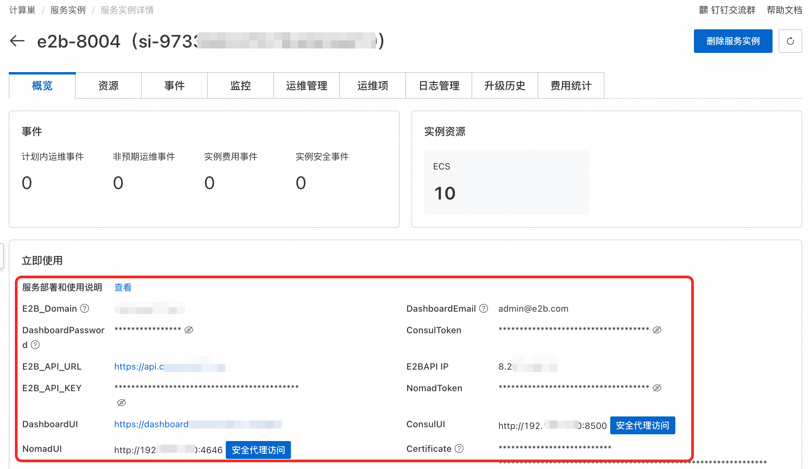

### 2. 登录 E2B Dashboard
点击 `DashboardUI`，使用计算巢输出的账号与密码登录。当前预置邮箱为 `admin@e2b.com`，初始化密码以实例输出为准。

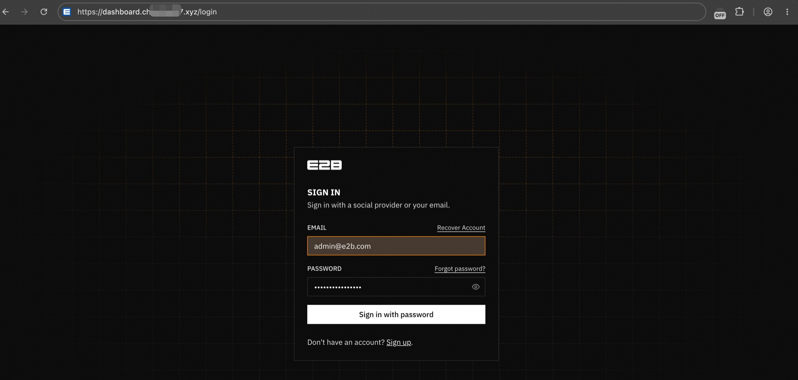

登录后先查看 **Sandboxes** 页面。这里可以观察当前并发、每秒启动速率、历史峰值和并发曲线。

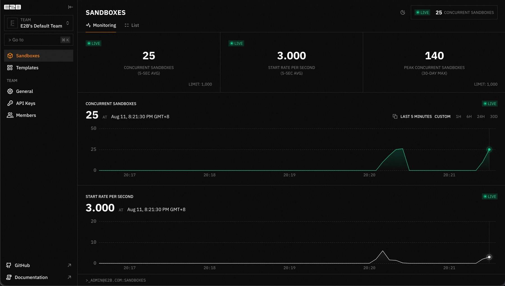

然后进入 **Templates**，确认 `base`、`code-interpreter-v1`、`browser-use`、`desktop` 等默认 Template 已经构建完成。

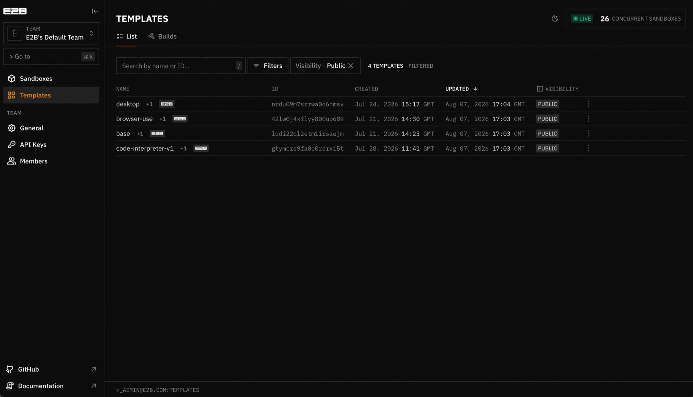

### 3. 通过 Nomad 检测 Jobs

通过计算巢提供的安全代理打开 `NomadUI`，使用计算巢输出的 NomadToken登录，检查Jobs是否都正常运行：
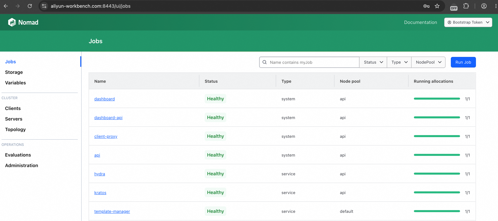


---

## 📖 使用流程

### 🐍 通过 Python SDK 使用

#### 快速开始
> ⚠️ **注意**：使用前，您需要配置好环境变量：
> - E2B_API_URL，E2B实例部署完成后可以在计算巢控制台的实例详情页查看
> - E2B_API_KEY，E2B实例部署完成后可以在计算巢控制台的实例详情页查看
> - E2B_DOMAIN，E2B 域名，您购买的公网域名or自定义域名
> - SSL_CERT_FILE，受信任的 CA 证书文件路径，仅在自建环境使用自签 CA 时需要


### 用例一：演示 Sandbox 完整生命周期

```python
import os

# 仅在自建环境使用自签 CA 时需要，且必须在 import e2b 前设置。
os.environ['SSL_CERT_FILE'] = '/path/to/ca-fullchain.pem'

from e2b import Sandbox

connection = {
    "api_url": os.environ["E2B_API_URL"],
    "api_key": os.environ["E2B_API_KEY"]
}

sandbox = Sandbox.create(
    template="base",
    timeout=60,
    **connection
)

try:
    sandbox_id = sandbox.sandbox_id
    print('[1/5] 创建 sandbox:', sandbox.sandbox_id)
    result = sandbox.commands.run('printf "hello from my own E2B" | tee /tmp/lifecycle.txt')
    print("[2/5] 执行命令")

    print("  stdout:", result.stdout)

    print("[3/5] 暂停 Sandbox")
    print("  paused:", sandbox.pause())

    print("[4/5] 恢复 Sandbox")
    sandbox = Sandbox.connect(sandbox_id, timeout=60, **connection)
    result = sandbox.commands.run("cat /tmp/lifecycle.txt")
    print("  resumed_stdout:", result.stdout)
finally:
    killed = sandbox.kill()
    print("[5/5] 删除 sandbox:", sandbox.sandbox_id)
```
运行脚本，输出如下
```text
[1/5] 创建 sandbox: xxx
[2/5] 执行命令
  stdout: hello from my own E2B
[3/5] 暂停 Sandbox
  paused: True
[4/5] 恢复 Sandbox
  resumed_stdout: hello from my own E2B
[5/5] 删除 sandbox: xxx
```

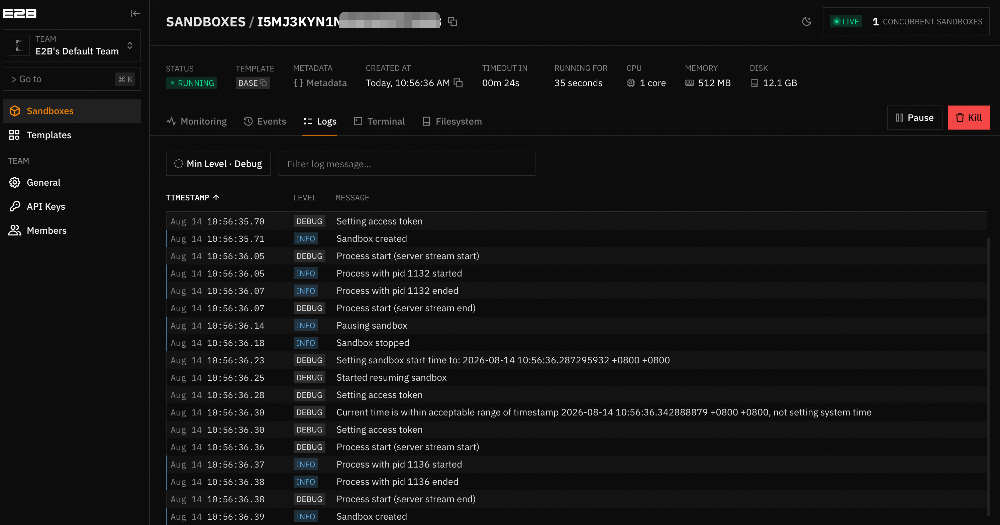

这个用例验证了完整生命周期链路：Create → Command → Pause → Resume → Kill。


### 用例二：构建 Template，并从 Template 创建 Sandbox

Template 用于固化基础镜像、依赖、文件、环境变量和启动命令。以下示例创建一个临时 Template，构建完成后再从它创建 Sandbox：

```python
import os

# 仅在自建环境使用自签 CA 时需要，且必须在 import e2b 前设置。
os.environ['SSL_CERT_FILE'] = '/path/to/ca-fullchain.pem'

from e2b import Sandbox, Template, default_build_logger, wait_for_timeout

connection = {
    "api_url": os.environ["E2B_API_URL"],
    "api_key": os.environ["E2B_API_KEY"],
}

template_name = "base"

template = (
    Template()
    .from_base_image()
    .set_envs({"HELLO": "hello from my own template"})
    .set_start_cmd('echo "$HELLO"', wait_for_timeout(1_000))
)

build = Template.build(
    template,
    template_name,
    cpu_count=2,
    memory_mb=2048,
    on_build_logs=default_build_logger(),
    **connection,
)

print("template_id:", build.template_id)
print("build_id:", build.build_id)

sandbox = Sandbox.create(template=template_name, timeout=120, **connection)
try:
    result = sandbox.commands.run("printf 'template sandbox is ready'")
    print("sandbox_id:", sandbox.sandbox_id)
    print("stdout:", result.stdout)
finally:
    sandbox.kill()
```
构建过程中可以在 **Templates / Builds** 查看状态与日志。
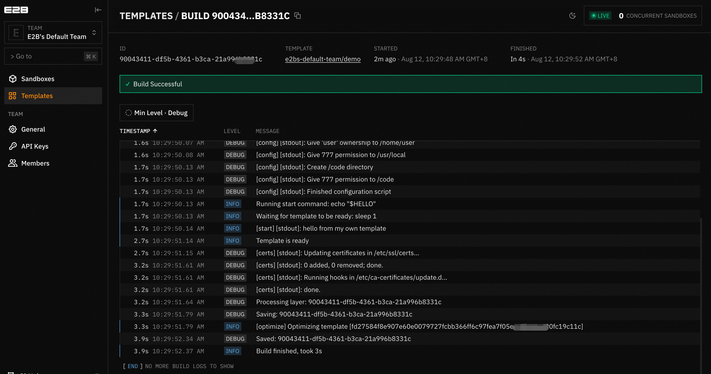


### 用例三：创建 Computer Use 桌面

`e2b-desktop` 在 Sandbox 生命周期上封装了桌面、鼠标键盘和 VNC Stream。以下示例创建一个 Desktop Sandbox，启动带临时密码的 noVNC 服务，并输出可以在浏览器中打开的 URL：

```python
import os

# 仅在自建环境使用自签 CA 时需要，且必须在 import e2b 前设置。
os.environ['SSL_CERT_FILE'] = '/path/to/ca-fullchain.pem'


from e2b_desktop import Sandbox

connection = {
    "api_url": os.environ["E2B_API_URL"],
    "api_key": os.environ["E2B_API_KEY"],
}

desktop = Sandbox.create(
    template="desktop",
    resolution=(1024, 720),
    dpi=96,
    timeout=300,
    **connection,
)

try:
    desktop.stream.start(require_auth=True)
    auth_key = desktop.stream.get_auth_key()
    stream_url = desktop.stream.get_url(auth_key=auth_key)

    # 执行一次真实桌面动作：打开网页并移动鼠标。
    desktop.open("https://example.com")
    desktop.wait(2_000)
    desktop.move_mouse(512, 360)

    print("View desktop at:", stream_url)
    print("screen_size:", desktop.get_screen_size())
    print("cursor_position:", desktop.get_cursor_position())
    input("在浏览器中打开 URL，验证完成后按回车清理资源：")
finally:
    try:
        desktop.stream.stop()
    finally:
        desktop.kill()
```

在浏览器中打开 stream_url，即可查看并操作 Sandbox 中的 Linux 桌面，验证完整的 Computer Use 链路。

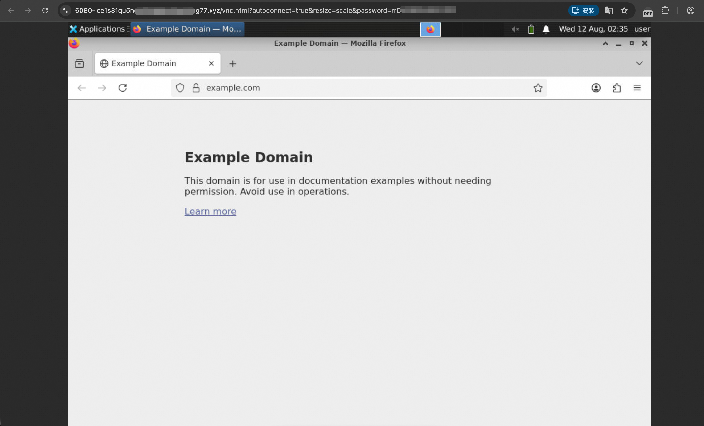

---

### 🖥️ 通过 E2B CLI 使用

#### 模板管理

**查看现有模板列表：**

```shell
e2b template list
```

**删除模板：**

```shell
e2b template delete <template-id>
```

#### 沙箱管理

**查看运行中的沙箱：**

```shell
e2b sandbox list
```

**连接到指定沙箱（交互式终端）：**

```shell
e2b sandbox connect <sandbox-id>
```

**终止沙箱：**

```shell
e2b sandbox kill <sandbox-id>
```

---

## ⚖️ 扩缩容配置

E2B 集群版基于阿里云**弹性伸缩（ESS）**实现 API Worker 和 Client Worker 节点的动态扩缩容，以应对不同的负载需求。

### 手动扩缩容

部署完成后，系统已预置以下四条弹性伸缩规则，可在阿里云 ESS 控制台手动执行：

| 规则名称 | 作用 | 调整数量 |
|---------|------|---------|
| `api-scaling-out` | API Worker 扩容 | +1 |
| `api-scaling-in` | API Worker 缩容 | -1 |
| `client-scaling-out` | Client Worker 扩容 | +1 |
| `client-scaling-in` | Client Worker 缩容 | -1 |

**操作步骤：**

1. 进入阿里云计算巢实例详情页，点击资源tab页，筛选弹性伸缩:伸缩组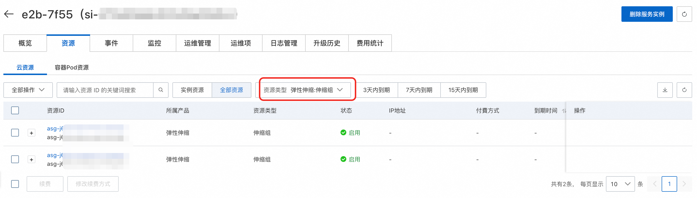
2. 找到对应的伸缩组（`client` 或 `api`）
3. 进入 **伸缩规则** 页面，选择对应规则点击 **执行**
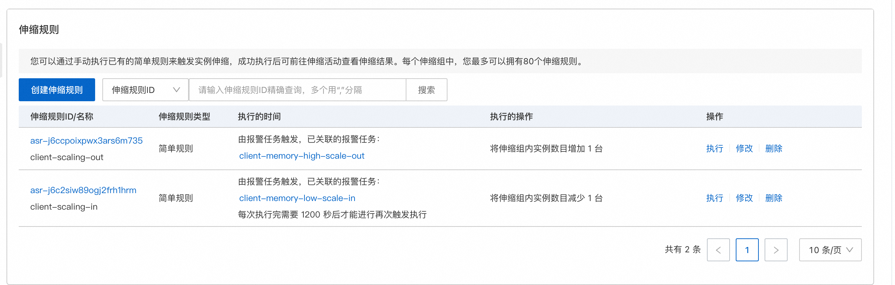

### 自动扩缩容

- 伸缩组平均内存使用率连续 1 分钟达到 75% 时，新增 1 台 ECS；
- 伸缩组平均CPU使用率连续 2 分钟达到 70% 时，新增 1 台 ECS；
- 伸缩组平均内存使用率连续 10 分钟低于 30% 时，缩容 1 台 ECS(默认不开启)

### 注意事项

> ⚠️ **缩容注意**：Client Worker 节点缩容时会触发生命周期钩子，系统会等待节点上的沙箱任务完成后再销毁实例（最长等待 **60 分钟**），请勿强制终止，避免沙箱数据丢失。

> ⚠️ **裸金属限制**：Client Worker 必须使用裸金属实例（`ecs.ebmg6` / `ecs.ebmc6` 系列），扩容时请确保所选可用区有足够的裸金属资源配额。

## 📊 可观测性配置（可选）

E2B 集群版基于阿里云 **Prometheus**、**Grafana** 实现可观测性：按下列步骤集成 Prometheus 与 Loki 后，可在 Grafana 中统一查询 Metrics 与 Logs 并完成可视化。

**操作步骤：**

1. 登录 [阿里云可观测可视化 Grafana 控制台](https://armsnext.console.aliyun.com/grafana#/workspace)。

2. 创建可观测可视化Grafana版：
   - 在左侧导航栏，单击工作区管理。
   - 在工作区列表中，单击创建工作区。
   - 在购买页面，配置地域和集群部署地域一致，版本选择专家版或者高级版，Grafana版本号选择 Grafana 11.4.x，并单击立即购买。

3. 开通私网地址：
   - 在 [阿里云可观测可视化 Grafana 控制台](https://armsnext.console.aliyun.com/grafana#/workspace) 工作区列表中，选择创建的工作区。
   - 在基本信息中，点击开通私网地址

   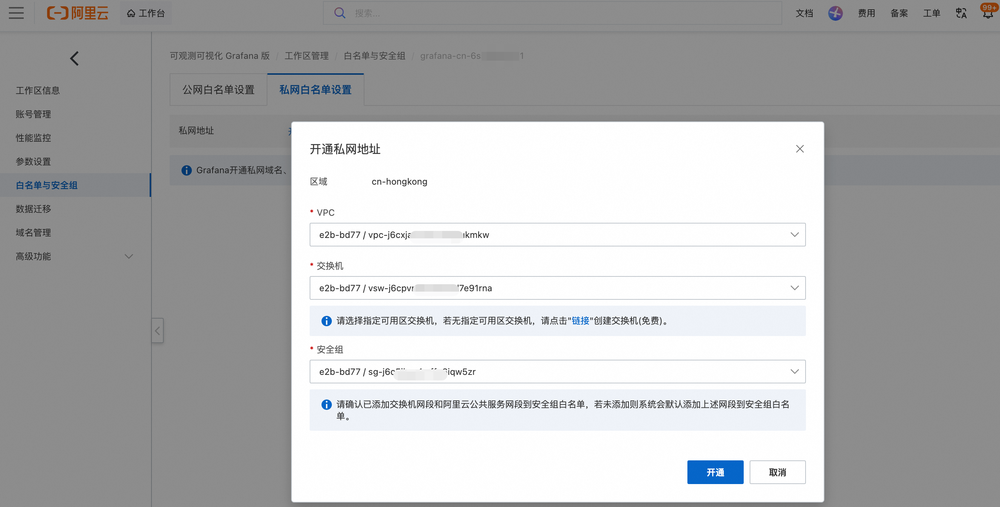

   - 选择集群部署的 VPC、交换机以及安全组，点击开通

4. 集成 Prometheus：
   - 在工作区页面的云服务集成中，选择 Prometheus 监控服务，搜索 prometheus-e2b, 点击集成。

   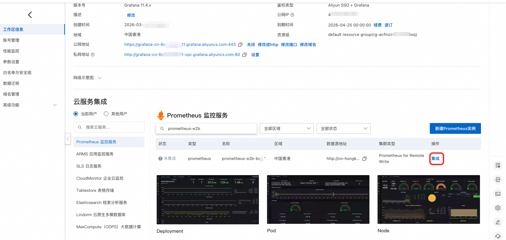

   - 集成数据源，配置ak、sk后，点击确认，请确认配置的 ak 具有 AliyunPrometheusMetricReadAccess 权限。

5. 集成 Loki：
   - 在工作区页面中，点击公网地址，进入 Grafana 公网页面。
   - 在左侧导航栏中，点击添加新连接，选择 Loki。

   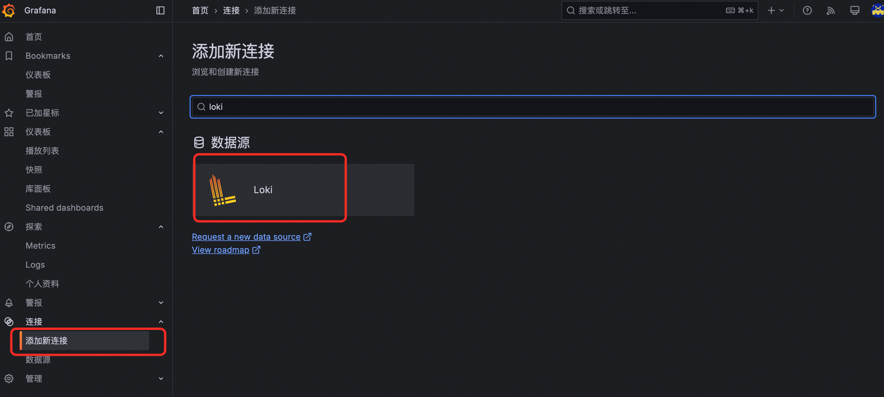

   - 配置 Connection，填写URL格式为：http://{API Worker ECS 的私网 IP}:3100
   
   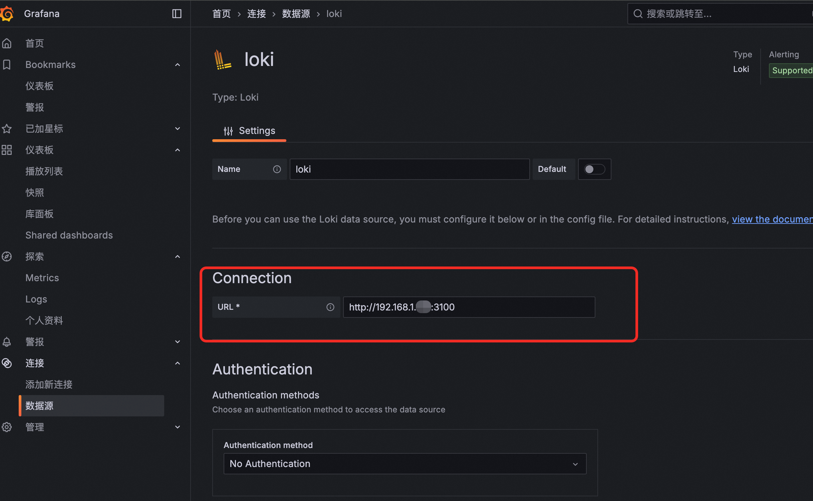   

   - 点击 Save & test 完成配置

6. 集成数据查看：
   - 在 Grafana 公网页面中，点击探索中的 Metrics，选择第 4 步配置的 Prometheus 集成的数据源，即可查看 Metrics 数据。

   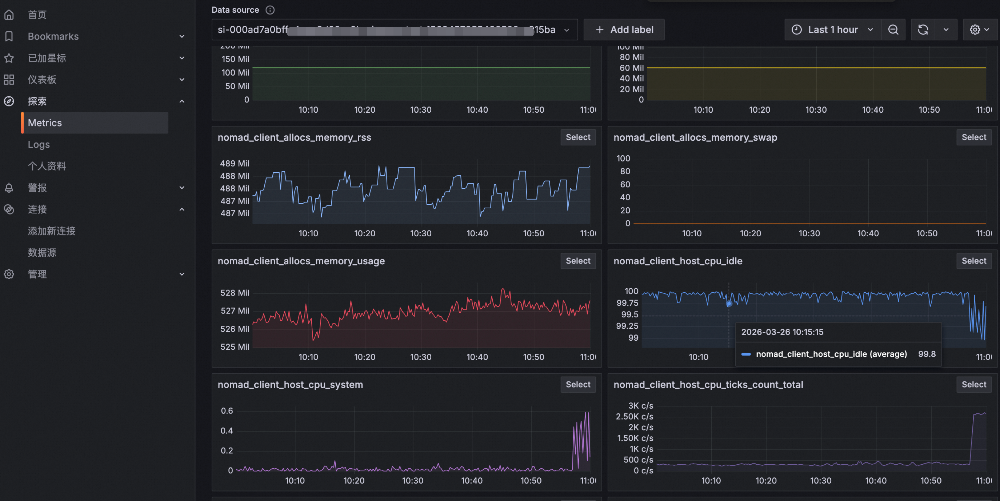

   - 在 Grafana 公网页面中，点击探索中的 Logs，选择第 5 步配置的 Loki 集成的数据源，即可查看 Logs 数据。

   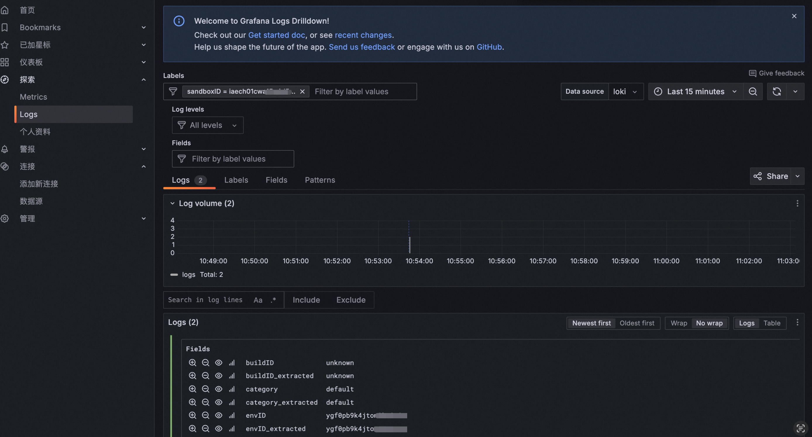
---

## 📚 更多资源

- **官方文档**：[E2B 官方文档](https://e2b.dev/docs)（含完整 API 参考、SDK 文档、智能体集成示例）
- **Python SDK**：[e2b-dev/e2b-code-interpreter](https://github.com/e2b-dev/e2b-code-interpreter)
- **CLI 工具**：[@e2b/cli on npm](https://www.npmjs.com/package/@e2b/cli)
