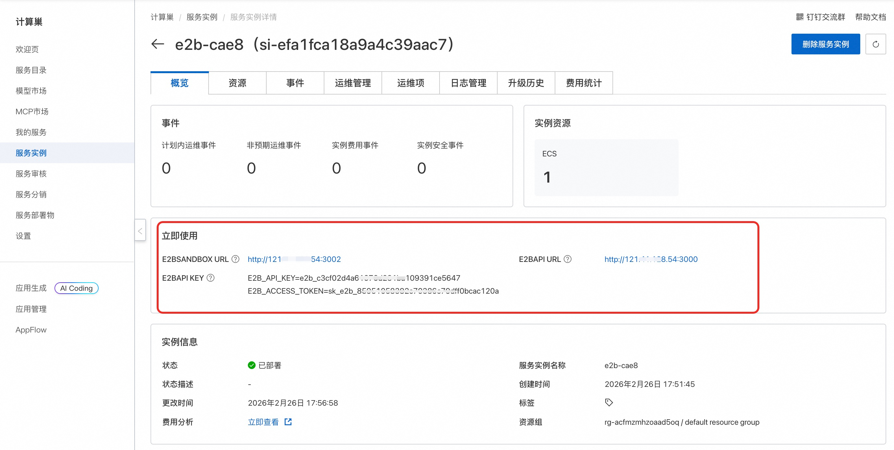
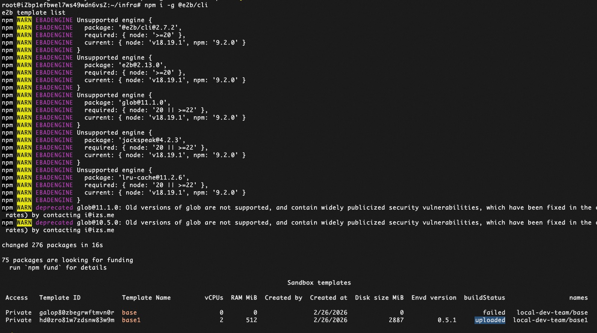

## 🌟 服务简介

E2B 社区版版是一个免费、开源的本地化代码执行引擎，适用于 LLM 智能体开发、自动化脚本测试、教育实验等场景。通过简洁的 Web 控制台或 RESTful API，用户可快速创建沙箱实例、上传文件、执行命令，并实时查看输出结果，所有操作均在容器级隔离环境中完成，保障主机系统安全。

## 🚀 部署流程

### 1. 一键创建实例  
访问 [计算巢 E2B 社区版部署页](https://computenest.console.aliyun.com/service/instance/create/cn-hangzhou?type=user&ServiceId=service-318e76fe0ae7464f8d5c)，按页面提示填写基础参数：  
  

### 2. 确认资源配置  
系统将自动生成**费用预估明细**。确认后点击 **下一步：确认订单**。在订单确认页核对信息无误，点击 **立即创建**。

### 3. 获取访问地址  
部署完成后，在控制台查看 **E2B 访问地址**：  
  

### 4. 开始使用  
首次使用需远程连接ECS，执行以下命令创建沙箱：
```shell
sudo su
cd /root/infra
make -C packages/shared/scripts local-build-base-template
```

沙箱创建完成后执行命令验证沙箱是否正常工作：
```shell
npm i -g @e2b/cli
e2b template list
```
  

## 📚 使用指南

- **官方文档**：[E2B 官方文档](https://e2b.dev/docs)（含沙箱 API、Python SDK、智能体集成示例）
